# Data Analysis on Brazilian online store "Olist" 

Data Analysis using the public dataset from the Brazilian online store "Olist" where sellers posting their products and sell.

**Data Description**

Dataset is consists of 9 datasets. 
- "olist_customers_dataset.csv" consists of customers' ID, customers' zip code, customers' cities and state
- "olist_orders_dataset.csv" consists of order ID, customers' ID, order delivery status, time of purchase, order approved date, order delivered date and order estimated date.
- "olist_sellers_dataset.csv" consists of sellers' ID, sellers' zip codes and sellers' cities and states.
- "olist_order_reviews_dataset.csv" consists of review ID, order ID, review score, review comments and review creation dates.
- "product_category_name_translaton.csv" consists of names or product categories.
- "olist_order_payments_dataset.csv" consists of order ID, payment type, installments of payments and payment values.
- "olist_order_items_dataset.csv" consists of order ID, product ID, seller ID, shipping limit date, price and freight values.
- "olist_geolocation_dataset.csv" consists of zip codes, latitudes, longitudes, cities and states.
- "olist_products_dataset.csv" consists of product ID, product name and size of the products.


**Modules to import**

```
import matplotlib.pyplot as plt
import pandas as pd
import os

import folium
from geopy.geocoders import Nominatim
import matplotlib.cm as cm
import matplotlib.colors as colors
import geocoder

from sklearn.cluster import KMeans

# To get the address by using latitudes and longitudes
import reverse_geocoder as rg
```

### 1. Where are the cities and the states with the most revenues? 


Read each files individually and create dataframes
```
cust_df = pd.read_csv('/Users/kitaeklee/Desktop/Data/brazilian-ecommerce/olist_customers_dataset.csv')
order_df = pd.read_csv('/Users/kitaeklee/Desktop/Data/brazilian-ecommerce/olist_orders_dataset.csv')
seller_df = pd.read_csv('/Users/kitaeklee/Desktop/Data/brazilian-ecommerce/olist_sellers_dataset.csv')
review_df = pd.read_csv('/Users/kitaeklee/Desktop/Data/brazilian-ecommerce/olist_order_reviews_dataset.csv')
productname_df = pd.read_csv('/Users/kitaeklee/Desktop/Data/brazilian-ecommerce/product_category_name_translation.csv')
pay_df = pd.read_csv('/Users/kitaeklee/Desktop/Data/brazilian-ecommerce/olist_order_payments_dataset.csv')
order_item_df = pd.read_csv('/Users/kitaeklee/Desktop/Data/brazilian-ecommerce/olist_order_items_dataset.csv')
location_df = pd.read_csv('/Users/kitaeklee/Desktop/Data/brazilian-ecommerce/olist_geolocation_dataset.csv')
```

Merge the dataframes on the identical variables to match the order_id and customer_id to payment value
```
# merge cust_df and order_df
cust_order_df = pd.merge(order_df, cust_df, on='customer_id', how='inner')

# merge with the pay_df
cust_order_pay_df = pd.merge(cust_order_df, pay_df, on='order_id', how='inner')
```

**Top 5 states with the highest revenues**
```

# create a new dataframe with states and payment_value
state_pay = cust_order_pay_df.loc[:, ['customer_state', 'payment_value']].groupby('customer_state').sum()
state_pay = state_pay.sort_values(by='payment_value', ascending=False).reset_index()
state_pay.head()
```


**Top 5 cities with the highest revenues**
```
# create a new dataframe with cities and total payment
city_pay = cust_order_pay_df.loc[:, ['customer_city', 'payment_value']].groupby('customer_city').sum()
city_pay = city_pay.sort_values(by='payment_value', ascending=False).reset_index()
city_pay.head()
```

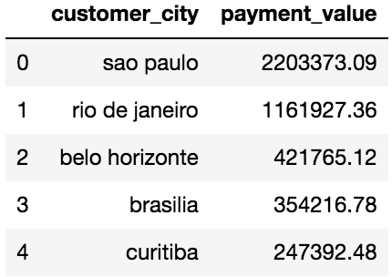

**Top 50 cities for revenues displayed in bar chart**
```
city_pay_top50 = city_pay.loc[0:49, :]

city_pay_top50.plot(kind='bar', x='customer_city', y='payment_value', figsize=(10,5))
plt.title('Cities with top 50 revenues')
plt.xlabel('Cities of customers')
plt.ylabel('Revenue')
plt.ticklabel_format(axis='y', useOffset=False, style='plain')
plt.show()
```
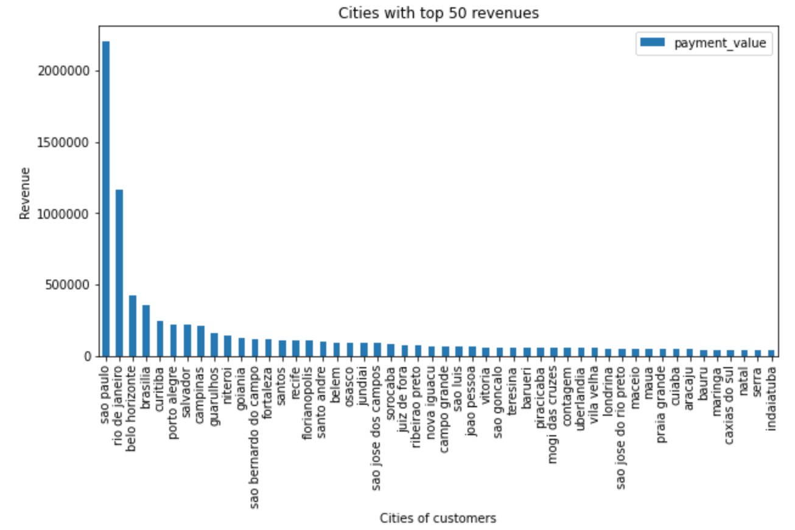

**States with the revenues in descending order displayed in bar chart**
```
state_pay.plot(kind='bar', figsize=(10,5), x='customer_state', y='payment_value')
plt.ticklabel_format(axis='y', style='plain', useOffset=False)
plt.title("States of customers and their revenues")
plt.xlabel("States of customers")
plt.ylabel("Revenue")
```

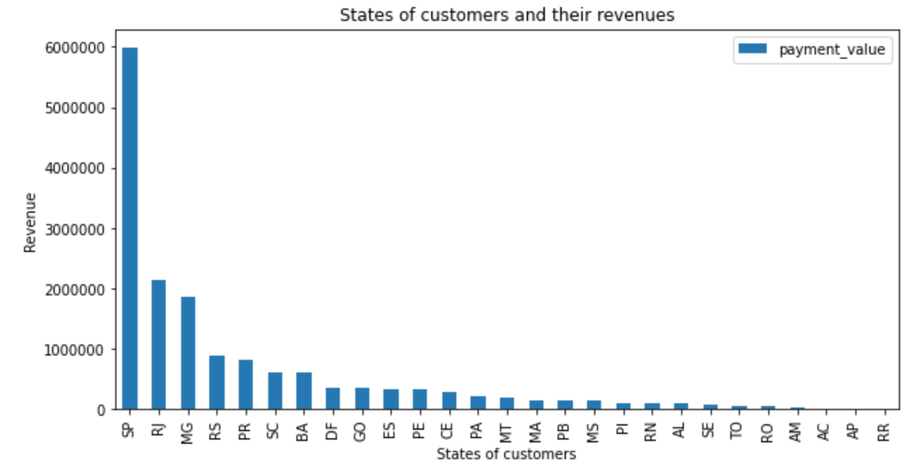

### 2. If, for example, Olist first decided to open their first offline store in Sao Paulo where the highest revenue coming from out of all the cities in Brazil, which area should Olist consider?

**Plan: Locate the location of customers in Sao Paulo, set the radius and choose the location where there are the most customers live around or choose the location where the most social places exist to find the location where it's easily accessible by potential customers.**

- The original dataset consist of 1000163 rows which contain the latitudes and longitudes of various cities so I extracted only the rows of the city "Sao Paulo" which has 135800 rows.
```
# Select the Sao Paulo data only
location_saopaulo_df = location_df.loc[location_df['geolocation_city']=='sao paulo'].reset_index()
location_saopaulo_df.drop(columns=['index'], inplace=True)
```

- Use reverse_geocoder and latitudes and longitudes from the dataset to get the name of the cities
```
res =  rg.search(tuple(zip(location_saopaulo_df['geolocation_lat'], 
                           location_saopaulo_df['geolocation_lng'])))
df_address = pd.DataFrame(res) 
```

- Create a map of Sao Paulo
```
location_saopaulo = geolocator.geocode("Sao Paulo, Brazil")
map_saopaulo = folium.Map(location=[location_saopaulo.latitude, location_saopaulo.longitude])
```
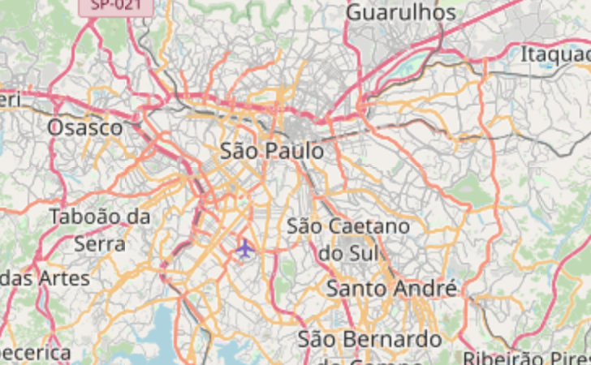

- Cluster the given data of latitudes and longitudes into the cities in Sao Paulo
```
from folium.plugins import FastMarkerCluster
             
callback = ('function (row) {' 
                'var marker = L.marker(new L.LatLng(row[0], row[1]), {color: "red"});'
                'var icon = L.AwesomeMarkers.icon({'
                "icon: 'info-sign',"
                "iconColor: 'white',"
                "markerColor: 'green',"
                "prefix: 'glyphicon',"
                "extraClasses: 'fa-rotate-0'"
                    '});'
                'marker.setIcon(icon);'
                "var popup = L.popup({maxWidth: '300'});"
                "const display_text = {text: row[2]};"
                "var mytext = $(`<div id='mytext' class='display_text' style='width: 100.0%; height: 100.0%;'> ${display_text.text}</div>`)[0];"
                "popup.setContent(mytext);"
                "marker.bindPopup(popup);"
                'return marker};')
                             
map_saopaulo.add_child(FastMarkerCluster(df_address[['lat', 'lon','name']].values.tolist(), callback=callback))
```
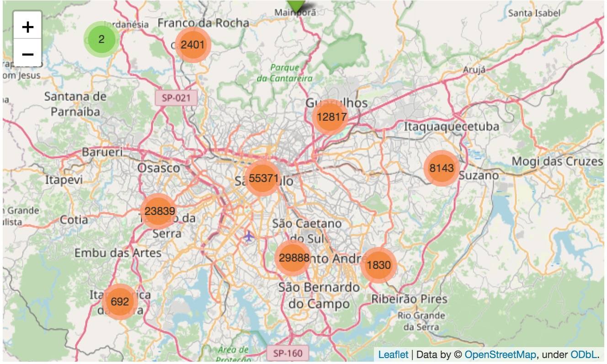
Among the cities in Sao Paulo, Brazil, the most accessible city and where the most Olist's customers are living in is city Sao Paulo in the state Sao Paulo.

- Find the best Borough to open the clothing store

Since now I know that the best city is Sao Paulo in the state Sao Paulo, I found the list of boroughs in Sao Paulo and made the list then create the new dataframe containing the list of Boroughs.
```
# Which borough shoud Olist choose to open the store in Sao Paulo
# Get the boroughs in Sao Paulo and get the latitude and longitude of each
borough_saopaulo = pd.DataFrame(columns=['borough'])
list_borough = ['Aricanduva', 'Butantã', 'Campo Limpo', 'Casa Verde',
       'Cidade Ademar', 'Cidade Tiradentes', 'Ermelino Matarazzo', 'Freguesia-Brasilândia',
       'Guaianases', 'Ipiranga', 'Itaim Paulista', 'Itaquera', 'Jabaquara', 'Jaçanã-Tremembé',
       'Lapa', 'M\'Boi Mirim', 'Mooca', 'Parelheiros', 'Penha', 'Perus', 'Pinheiros',
       'Pirituba-Jaraguá', 'Santana-Tucuruvi', 'Santo Amaro', 'São Mateus', 'São Miguel Paulista',
       'Sapopemba', 'Sé', 'Villa Guilherme', 'Vila Mariana',
       'Vila Prudente']
num=0
for x in list_borough:
    borough_saopaulo.loc[num, 'borough'] = x
    num+=1
```

Add the empty columns of latitude and longitude to the new dataframe. Then, use the name of boroughs to get latitudes and longitudes of each borough.
```
# Create empty colums for latitude and longitude
borough_saopaulo['latitude']=""
borough_saopaulo['longitude']=""

# Use name of Boroughs to get latitude and logitude and apply to the new columns
y=0
for x in borough_saopaulo.loc[:,'borough']:
    geolocator = Nominatim(user_agent="foursquare_agent")
    location = geolocator.geocode("{}, São Paulo, Brazil".format(x))
    borough_saopaulo.loc[y, 'latitude'] = location.latitude
    borough_saopaulo.loc[y, 'longitude'] = location.longitude
    y+=1
```
First 5 rows of the new dataframe which consist of the name of borough, latitude and longitude as an exmaple.
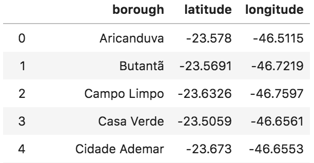

- Define the Foursquare information and radius
```
# Define Foursquare Credentials and Version
CLIENT_ID = '3MAR2Y4AH5PUQKHSI4TCMUQMLU2S45MO0TVJAKMHDDHAGINK' #  Foursquare ID
CLIENT_SECRET = 'SRPNGW0J3R5EFCSNVENLIXE4BUCCI0X2EEDBYRZTGYLY4HL3' #  Foursquare Secret
VERSION = '20180605' # Foursquare API version

# Define the radius 
radius=3000    # radius in meters
LIMIT = 200    # limit the number of venues to return
```

- Define the function for getting the venues
```
def getNearbyVenues(names, latitudes, longitudes, radius=500):
    
    venues_list=[]
    for name, lat, lng in zip(names, latitudes, longitudes):
        print(name)
            
        # create the API request URL
        url = 'https://api.foursquare.com/v2/venues/explore?&client_id={}&client_secret={}&v={}&ll={},{}&radius={}&limit={}'.format(
            CLIENT_ID, 
            CLIENT_SECRET, 
            VERSION, 
            lat, 
            lng, 
            radius, 
            LIMIT)
            
        # make the GET request
        results = requests.get(url).json()["response"]['groups'][0]['items']
        
        # return only relevant information for each nearby venue
        venues_list.append([(
            name, 
            lat, 
            lng, 
            v['venue']['name'], 
            v['venue']['location']['lat'], 
            v['venue']['location']['lng'],  
            v['venue']['categories'][0]['name']) for v in results])

    nearby_venues = pd.DataFrame([item for venue_list in venues_list for item in venue_list])
    nearby_venues.columns = ['Borough', 
                  'Borough Latitude', 
                  'Borough Longitude', 
                  'Venue', 
                  'Venue Latitude', 
                  'Venue Longitude', 
                  'Venue Category']
    
    return(nearby_venues)
```

- Use the defined function to get the venues
```
# def function on each neighborhood and create a new dataframe
saopaulo_venues = getNearbyVenues(names=borough_saopaulo['borough'],
                                   latitudes=borough_saopaulo['latitude'],
                                   longitudes=borough_saopaulo['longitude']
                                  )
```

- Check the list of venues to see if there are venues to replace for better clustering result
```
# List of all venues (duplicates removed)
all_venues_list = list(saopaulo_venues['Venue Category'])
venues_list=[]
for venue in all_venues_list:
    if venue not in venues_list:
        venues_list.append(venue)
venues_list
```
Example of the venues

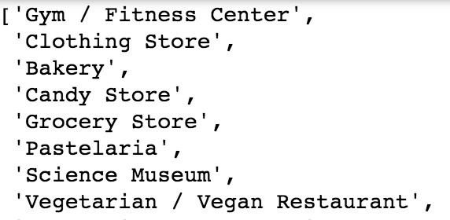

- **Data Preprocessing**  :  Since venues in 'Venue Category' have duplicates but with different names, replace the values if they can be categorized into same name of the venue.
For example, Sake Bar and Lounge will be replaced to 'Bar'
List of Venues
```
# List of venues to replace the values
list_gym = ['Gym / Fitness Center', 'Gymnastics Gym', 'College Gym', 'Gym']
list_leisure=['Pool', 'Gym Pool', 'Spa', 'Skate Park', 'Bowling Alley', 
              'Pool Hall', 'Outdoors & Recreation', 'Arcade']
list_theater = ['Theater', 'Movie Theater', 'Multiplex', 'Indie Theater']
list_park = ['Skate Park']
list_sports = ['Athletics & Sports','Martial Arts Dojo', 'Dance Studio']
list_station = ['Metro Station', 'Train Station', 'Bus Station']
list_art = ['Art Gallery', 'Art Museum', 'Science Museum', 'History Museum',
           'Street Art', 'Museum']
list_pastry = ['Pastry Shop', 'Bakery', 'Pastelaria', 'Pie Shop']
list_drink = ['Bar', 'Sake Bar', 'Lounge', 'Brewery', 'Beer Store',
             'Beer Bar', 'Gastropub', 'Speakeasy', 'Dive Bar', 
             'Beer Garden']
list_dessert = ['Creperie', 'Cupcake Shop', 'Candy Store', 'Dessert Shop',
               'Ice Cream Shop', 'Snack Place', 'Chocolate Shop',
               'Acai House']
list_fashion = ['Men\'s Store', 'Women\'s Store', 'Thrift / Vintage Store',
               'Shoe Store', 'Jewelry Store', 'Costume Shop', 'Outlet Store']
list_restaurant = ['Vegetarian / Vegan Restaurant', 'Asian Restaurant',
                  'Brazilian Restaurant', 'Diner', 'Mineiro Restaurant',
                  'Fried Chicken Joint', 'Steakhouse', 'Burger Joint',
                  'Pizza Place', 'Food', 'Wings Joint', 'BBQ Joint',
                  'Comfort Food Restaurant', 'Food & Drink Shop',
                  'Food Stand', 'Buffet', 'Deli / Bodega', 
                  'Italian Restaurant', 'American Restaurant',
                  'Paella Restaurant', 'Seafood Restaurant', 'Bistro',
                  'Sandwich Place', 'Japanese Restaurant', 'Argentinian Restaurant',
                  'Sushi Restaurant', 'Food Truck', 'Breakfast Spot',
                  'Persian Restaurant', 'Empanada Restaurant', 'Bagel Shop',
                  'Hot Dog Joint', 'Fast Food Restaurant', 'Cafeteria',
                  'Mexican Restaurant', 'Middle Eastern Restaurant', 
                  'Chinese Restaurant', 'Falafel Restaurant', 'Northern Brazilian Restaurant',
                  'Tapiocaria', 'Noodle House', 'Halal Restaurant', 'Empada House',
                  'Churrascaria']
list_artvenue = ['Performing Arts Venue', 'Music Venue', 'Arts & Entertainment',
                'Concert Hall', 'Auditorium']
list_grocery = ['Grocery Store', 'Fruit & Vegetable Store', 'Supermarket'
               ,'Farmers Market', 'Market', 'Convenience Store']
list_home = ['Mattress Store', 'Furniture / Home Store']
list_mall = ['Plaza', 'Department Store', 'Mall', 'Pedestrian Plaza']
list_cafe = ['Tea Room', 'Juice Bar', 'Coffee Shop', 'Café', 'Cafe']
list_club = ['Rock Club', 'Nightclub', 'Club']
list_accomodations = ['Hotel', 'Motel', 'Hostel', 'Bed & Breakfast']
list_pharmacy = ['Drugstore', 'Pharmacy']

# Replace the values of venues
saopaulo_venues['Venue Category'] = saopaulo_venues['Venue Category'].replace(list_gym, 'Gym')
saopaulo_venues['Venue Category'] = saopaulo_venues['Venue Category'].replace(list_leisure, 'Leisure & Recreation')
saopaulo_venues['Venue Category'] = saopaulo_venues['Venue Category'].replace(list_theater, 'Theater')
saopaulo_venues['Venue Category'] = saopaulo_venues['Venue Category'].replace(list_park, 'Park')
saopaulo_venues['Venue Category'] = saopaulo_venues['Venue Category'].replace(list_sports, 'Sports Studio')
saopaulo_venues['Venue Category'] = saopaulo_venues['Venue Category'].replace(list_station, 'Public Transportation')
saopaulo_venues['Venue Category'] = saopaulo_venues['Venue Category'].replace(list_art, 'Gallery & Museum')
saopaulo_venues['Venue Category'] = saopaulo_venues['Venue Category'].replace(list_pastry, 'Pastry & Bakery')
saopaulo_venues['Venue Category'] = saopaulo_venues['Venue Category'].replace(list_drink, 'Pub & Bar')
saopaulo_venues['Venue Category'] = saopaulo_venues['Venue Category'].replace(list_dessert, 'Dessert')
saopaulo_venues['Venue Category'] = saopaulo_venues['Venue Category'].replace(list_fashion, 'Fashion Store')
saopaulo_venues['Venue Category'] = saopaulo_venues['Venue Category'].replace(list_restaurant, 'Restaurant')
saopaulo_venues['Venue Category'] = saopaulo_venues['Venue Category'].replace(list_artvenue, 'Art Venues')
saopaulo_venues['Venue Category'] = saopaulo_venues['Venue Category'].replace(list_grocery, 'Grocery')
saopaulo_venues['Venue Category'] = saopaulo_venues['Venue Category'].replace(list_home, 'Home Store')
saopaulo_venues['Venue Category'] = saopaulo_venues['Venue Category'].replace(list_mall, 'Mall')
saopaulo_venues['Venue Category'] = saopaulo_venues['Venue Category'].replace(list_cafe, 'Cafe')
saopaulo_venues['Venue Category'] = saopaulo_venues['Venue Category'].replace(list_club, 'Club')
saopaulo_venues['Venue Category'] = saopaulo_venues['Venue Category'].replace(list_accomodations, 'Accomodations')
saopaulo_venues['Venue Category'] = saopaulo_venues['Venue Category'].replace(list_pharmacy, 'Pharmacy')
```

- **"One hot encoding"** to convert categorical variables to numeric variables.
```
saopaulo_onehot = pd.get_dummies(saopaulo_venues[['Venue Category']], prefix="", prefix_sep="")

# add borough column back to dataframe
saopaulo_onehot['Borough'] = saopaulo_venues['Borough'] 

# move borough column to the first column
saopaulo_onehot = saopaulo_onehot.set_index('Borough').reset_index()
```
- Group rows by borough and by taking the mean of the frequency of occurence of each category then write a function that sort the venues in descending order.
```
saopaulo_grouped = saopaulo_onehot.groupby('Borough').mean().reset_index()

# Write a function to sort the venues in descending order.
def return_most_common_venues(row, num_top_venues):
    row_categories = row.iloc[1:]
    row_categories_sorted = row_categories.sort_values(ascending=False)
    
    return row_categories_sorted.index.values[0:num_top_venues]
```
- Create a new dataframe and display top 10 venues for each borough.
```
# Create a new dataframe and display top 10 venues for each borough
import numpy as np
num_top_venues = 5

indicators = ['st', 'nd', 'rd']

# create columns according to number of top venues
columns = ['Borough']
for ind in np.arange(num_top_venues):
    try:
        columns.append('{}{} Most Common Venue'.format(ind+1, indicators[ind]))
    except:
        columns.append('{}th Most Common Venue'.format(ind+1))

# create a new dataframe
borough_venues_sorted = pd.DataFrame(columns=columns)
borough_venues_sorted['Borough'] = saopaulo_grouped['Borough']

for ind in np.arange(saopaulo_grouped.shape[0]):
    borough_venues_sorted.iloc[ind, 1:] = return_most_common_venues(saopaulo_grouped.iloc[ind, :], num_top_venues)
```
- **Find the optimal 'K' for K-means clustering.**
- Drop the column 'Borough' for clustering
```
saopaulo_grouped_clustering = saopaulo_grouped.drop('Borough', 1)
```

- **Elbow Method**
```
# Use Elbow Method to find the optimal 'k' (number of clusters)
distortions = []
K = range(1,10)
for k in K:
    kmeanModel = KMeans(n_clusters=k)
    kmeanModel.fit(saopaulo_grouped_clustering)
    distortions.append(kmeanModel.inertia_)
    
plt.figure(figsize=(16,8))
plt.plot(K, distortions, 'bx-')
plt.xlabel('k')
plt.ylabel('Distortion')
plt.title('The Elbow Method showing the optimal k')
plt.show()
```
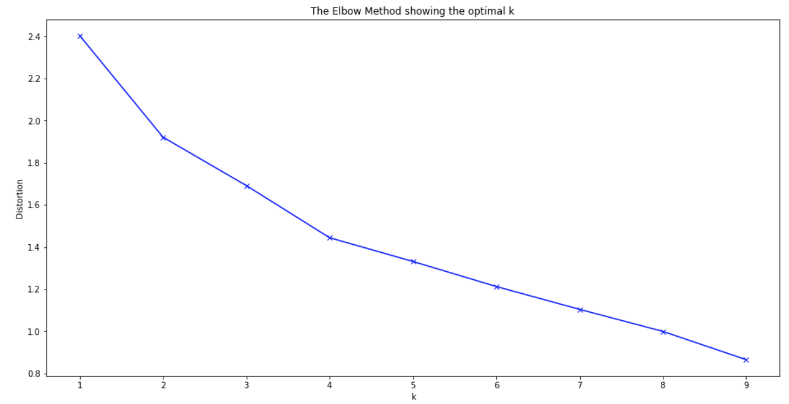
However, Elbow Method does not show "elbow" where it shows the optimal "k". Therefore, I used the "Silhouette Method" to find the optimal number of clusters

- **Silhouette Method**
```
from sklearn.metrics import silhouette_score

sil=[ ]
kmax=10
K=range(2,kmax+1)

#dissimilarity would not be defined for a single cluster, thus minimum number of clusters should be 2
for k in K:
    kmeans = KMeans(n_clusters = k).fit(saopaulo_grouped_clustering)
    labels = kmeans.labels_
    sil.append(silhouette_score(saopaulo_grouped_clustering, labels, metric = 'euclidean'))
    
plt.plot(K, sil)
plt.xlabel('k')
plt.ylabel('Silhoutte method')
```
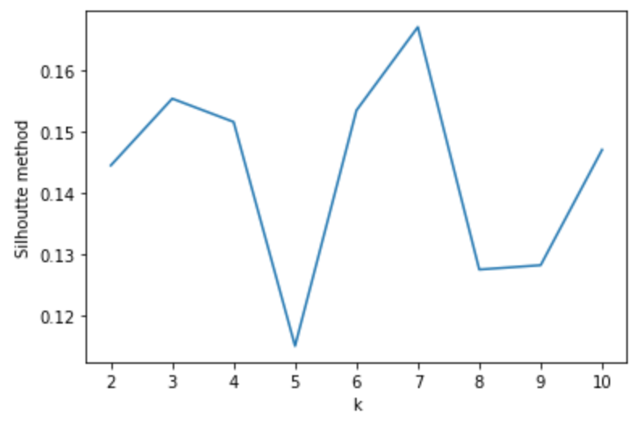
Based on the result of the Silhouette Method, the optimal number of clusters is "7".

- Run K-Means Clustering with k=7 and create a new dataframe with cluster labels.
```
# Based on the Silhouette Method, the optimal number of clusters is 7
kclusters=7

# run k-means clustering
kmeans = KMeans(n_clusters=kclusters, random_state=0).fit(saopaulo_grouped_clustering)

# check cluster labels generated for each row in the dataframe
kmeans.labels_[0:10] 

# Create a new dataframe that includes the cluster as well as the top 10 venues for each borough.
# add clustering labels

borough_venues_sorted.insert(0, 'Cluster Labels', kmeans.labels_) 

saopaulo_merged = borough_saopaulo

# merge saopaulo_grouped with saopaulo_data to add latitude/longitude for each borough
saopaulo_merged = saopaulo_merged.join(borough_venues_sorted.set_index('Borough'), on='borough')
```
Example of the new dataframe
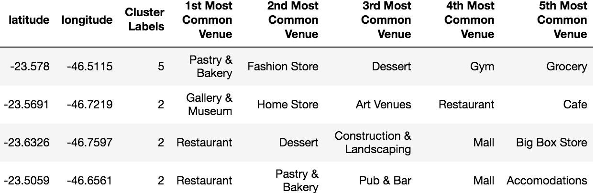

- Visualization of the map of K-means clustering
```
# Visualize
# create map
location_saopaulo = geolocator.geocode("Sao Paulo, Sao Paulo, Brazil")
map_clusters = folium.Map(location=[location_saopaulo.latitude, location_saopaulo.longitude], zoom_start=10)


# set color scheme for the clusters
x = np.arange(kclusters)
ys = [i + x + (i*x)**2 for i in range(kclusters)]
colors_array = cm.rainbow(np.linspace(0, 1, len(ys)))
rainbow = [colors.rgb2hex(i) for i in colors_array]

# add markers to the map
markers_colors = []
for lat, lon, poi, cluster in zip(saopaulo_merged['latitude'], saopaulo_merged['longitude'], saopaulo_merged['borough'], saopaulo_merged['Cluster Labels']):
    label = folium.Popup(str(poi) + ' Cluster ' + str(cluster), parse_html=True)
    folium.CircleMarker(
        [lat, lon],
        radius=5,
        popup=label,
        color=rainbow[cluster-1],
        fill=True,
        fill_color=rainbow[cluster-1],
        fill_opacity=0.7).add_to(map_clusters)
```
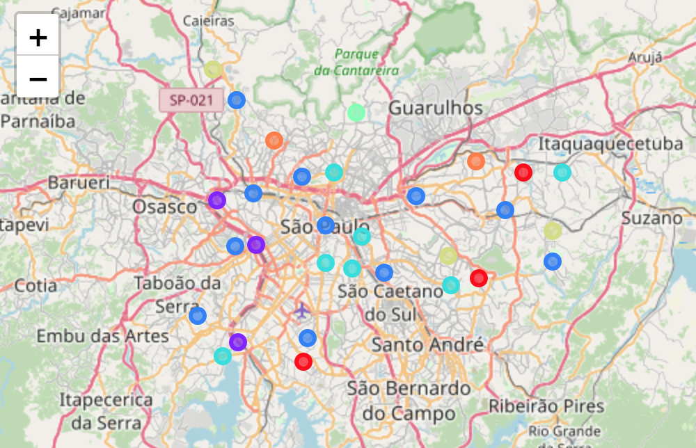


- To examine the clusters, return the dataframe of each cluster with top 5 venues
```
# Examine cluster 1
saopaulo_merged.loc[saopaulo_merged['Cluster Labels'] == 0, 
                     saopaulo_merged.columns[[0] + list(range(4, saopaulo_merged.shape[1]))]]
# Examine cluster 2
saopaulo_merged.loc[saopaulo_merged['Cluster Labels'] == 1, 
                     saopaulo_merged.columns[[0] + list(range(4, saopaulo_merged.shape[1]))]]
# Examine cluster 3
saopaulo_merged.loc[saopaulo_merged['Cluster Labels'] == 2, 
                     saopaulo_merged.columns[[0] + list(range(4, saopaulo_merged.shape[1]))]]         # Examine cluster 4
saopaulo_merged.loc[saopaulo_merged['Cluster Labels'] == 3, 
                     saopaulo_merged.columns[[0] + list(range(4, saopaulo_merged.shape[1]))]]         # Examine cluster 5
saopaulo_merged.loc[saopaulo_merged['Cluster Labels'] == 4, 
                     saopaulo_merged.columns[[0] + list(range(4, saopaulo_merged.shape[1]))]]   
# Examine cluster 6
saopaulo_merged.loc[saopaulo_merged['Cluster Labels'] == 5, 
                     saopaulo_merged.columns[[0] + list(range(4, saopaulo_merged.shape[1]))]]
# Examine cluster 7
saopaulo_merged.loc[saopaulo_merged['Cluster Labels'] == 6, 
                     saopaulo_merged.columns[[0] + list(range(4, saopaulo_merged.shape[1]))]]
```
Then it returns dataframe like this as an example:
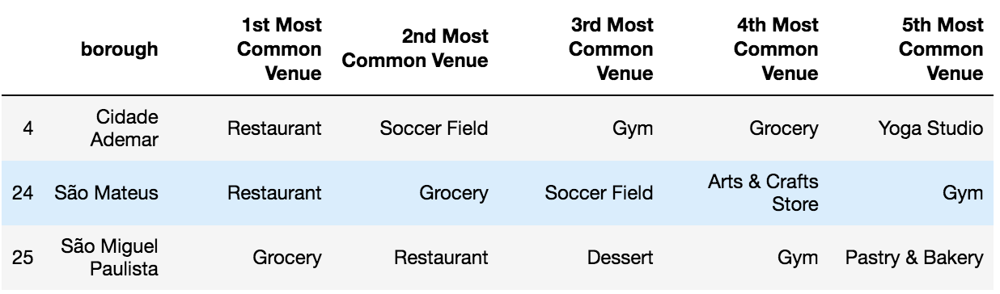


- Create a Dataframes for each clusters with number of 1st Most Common Venue counted to create a bar graph
```
# Count venues for cluster 0 and create a dataframe
df_cluster_0 = pd.DataFrame(columns=['Cluster', 'Count', '1st Most Common Venue'])
count0r = cluster_1st[(cluster_1st['Cluster Labels']==0) & (cluster_1st['1st Most Common Venue']=='Restaurant')].count()
count0g = cluster_1st[(cluster_1st['Cluster Labels']==0) & (cluster_1st['1st Most Common Venue']=='Grocery')].count()

df_cluster_0.loc[0, 'Cluster'] = 0
df_cluster_0.loc[1, 'Cluster'] = 0
    
df_cluster_0.loc[0,'Count'] = count0r['Cluster Labels']
df_cluster_0.loc[1, 'Count'] = count0g['Cluster Labels']
df_cluster_0.loc[0,'1st Most Common Venue'] = 'Restaurant'
df_cluster_0.loc[1,'1st Most Common Venue'] = 'Grocery'


# Count venues for cluster 1 and create a dataframe
df_cluster_1 = pd.DataFrame(columns=['Cluster', 'Count', '1st Most Common Venue'])
count1r = cluster_1st[(cluster_1st['Cluster Labels']==1) & (cluster_1st['1st Most Common Venue']=='Restaurant')].count()

df_cluster_1.loc[0, 'Cluster'] = 1

df_cluster_1.loc[0,'Count'] = count1r['Cluster Labels']
df_cluster_1.loc[0,'1st Most Common Venue'] = 'Restaurant'


# Count venues for cluster 2 and create a dataframe
df_cluster_2 = pd.DataFrame(columns=['Cluster', 'Count', '1st Most Common Venue'])
count2r = cluster_1st[(cluster_1st['Cluster Labels']==2) & (cluster_1st['1st Most Common Venue']=='Restaurant')].count()
count2m = cluster_1st[(cluster_1st['Cluster Labels']==2) & (cluster_1st['1st Most Common Venue']=='Mall')].count()
count2h = cluster_1st[(cluster_1st['Cluster Labels']==2) & (cluster_1st['1st Most Common Venue']=='Home Store')].count()
count2gm = cluster_1st[(cluster_1st['Cluster Labels']==2) & (cluster_1st['1st Most Common Venue']=='Gallery & Museum')].count()
count2d = cluster_1st[(cluster_1st['Cluster Labels']==2) & (cluster_1st['1st Most Common Venue']=='Dessert')].count()

df_cluster_2.loc[0, 'Cluster'] = 2
df_cluster_2.loc[1, 'Cluster'] = 2
df_cluster_2.loc[2, 'Cluster'] = 2
df_cluster_2.loc[3, 'Cluster'] = 2
df_cluster_2.loc[4, 'Cluster'] = 2

df_cluster_2.loc[0,'Count'] = count2r['Cluster Labels']
df_cluster_2.loc[1,'Count'] = count2m['Cluster Labels']
df_cluster_2.loc[2,'Count'] = count2h['Cluster Labels']
df_cluster_2.loc[3,'Count'] = count2gm['Cluster Labels']
df_cluster_2.loc[4,'Count'] = count2d['Cluster Labels']

df_cluster_2.loc[0,'1st Most Common Venue'] = 'Restaurant'
df_cluster_2.loc[1,'1st Most Common Venue'] = 'Mall'
df_cluster_2.loc[2,'1st Most Common Venue'] = 'Home Store'
df_cluster_2.loc[3,'1st Most Common Venue'] = 'Gallery & Museum'
df_cluster_2.loc[4,'1st Most Common Venue'] = 'Dessert'


# Count venues for cluster 3 and create a dataframe
df_cluster_3 = pd.DataFrame(columns=['Cluster', 'Count', '1st Most Common Venue'])

df_cluster_3.loc[0, 'Cluster'] = 3

count3r = cluster_1st[(cluster_1st['Cluster Labels']==3) & (cluster_1st['1st Most Common Venue']=='Restaurant')].count()

df_cluster_3.loc[0,'Count'] = count3r['Cluster Labels']
df_cluster_3.loc[0,'1st Most Common Venue'] = 'Restaurant'


# Count venues for cluster 4 and create a dataframe
df_cluster_4 = pd.DataFrame(columns=['Cluster', 'Count', '1st Most Common Venue'])

df_cluster_4.loc[0, 'Cluster'] = 4

count4pb = cluster_1st[(cluster_1st['Cluster Labels']==4) & (cluster_1st['1st Most Common Venue']=='Pastry & Bakery')].count()
df_cluster_4.loc[0,'Count'] = count4pb['Cluster Labels']
df_cluster_4.loc[0,'1st Most Common Venue'] = 'Pastry & Bakery'


# Count venues for cluster 5 and create a dataframe
df_cluster_5 = pd.DataFrame(columns=['Cluster', 'Count', '1st Most Common Venue'])

df_cluster_5.loc[0, 'Cluster'] = 5
df_cluster_5.loc[1, 'Cluster'] = 5
df_cluster_5.loc[2, 'Cluster'] = 5

count5pb = cluster_1st[(cluster_1st['Cluster Labels']==5) & (cluster_1st['1st Most Common Venue']=='Pastry & Bakery')].count()
count5m = cluster_1st[(cluster_1st['Cluster Labels']==5) & (cluster_1st['1st Most Common Venue']=='Mall')].count()
count5g = cluster_1st[(cluster_1st['Cluster Labels']==5) & (cluster_1st['1st Most Common Venue']=='Grocery')].count()

df_cluster_5.loc[0,'Count'] = count5pb['Cluster Labels']
df_cluster_5.loc[0,'1st Most Common Venue'] = 'Pastry & Bakery'
df_cluster_5.loc[1, 'Count'] = count5m['Cluster Labels']
df_cluster_5.loc[1, '1st Most Common Venue'] = 'Mall'
df_cluster_5.loc[2, 'Count'] = count5g['Cluster Labels']
df_cluster_5.loc[2, '1st Most Common Venue'] = 'Grocery'


# Count venues for cluster 6 and create a dataframe
df_cluster_6 = pd.DataFrame(columns=['Cluster', 'Count', '1st Most Common Venue'])

df_cluster_6.loc[0, 'Cluster'] = 6
df_cluster_6.loc[1, 'Cluster'] = 6


count6r = cluster_1st[(cluster_1st['Cluster Labels']==6) & (cluster_1st['1st Most Common Venue']=='Restaurant')].count()
count6pb = cluster_1st[(cluster_1st['Cluster Labels']==6) & (cluster_1st['1st Most Common Venue']=='Pastry & Bakery')].count()

df_cluster_6.loc[0,'Count'] = count6r['Cluster Labels']
df_cluster_6.loc[0,'1st Most Common Venue'] = 'Restaurant'
df_cluster_6.loc[1,'Count'] = count6pb['Cluster Labels']
df_cluster_6.loc[1,'1st Most Common Venue'] = 'Pastry & Bakery'
```

Then concatenate all dataframes of each cluster
```
df_cluster_concat = pd.concat([df_cluster_0, df_cluster_1, df_cluster_2,
                              df_cluster_3, df_cluster_4, df_cluster_5,
                              df_cluster_6])
```
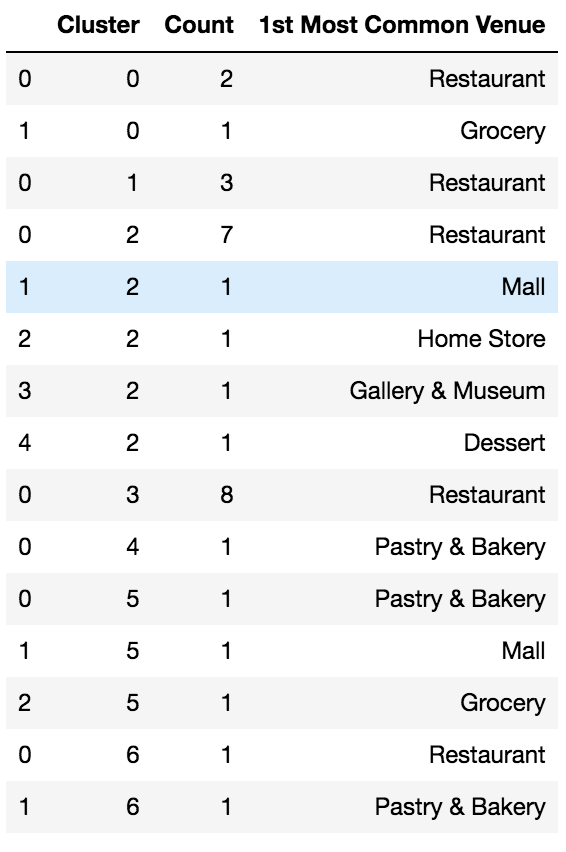

- Create a ***Bar Chart***
```
# Create temporary dataframes to store only the values satisfying the condition to apply each bars of venues different colors
temp1 = df_cluster_concat[df_cluster_concat['1st Most Common Venue']=='Restaurant']
temp2 = df_cluster_concat[df_cluster_concat['1st Most Common Venue']=='Grocery']
temp3 = df_cluster_concat[df_cluster_concat['1st Most Common Venue']=='Mall']
temp4 = df_cluster_concat[df_cluster_concat['1st Most Common Venue']=='Home Store']
temp5 = df_cluster_concat[df_cluster_concat['1st Most Common Venue']=='Gallery & Museum']
temp6 = df_cluster_concat[df_cluster_concat['1st Most Common Venue']=='Dessert']
temp7 = df_cluster_concat[df_cluster_concat['1st Most Common Venue']=='Pastry & Bakery']

# Create a Bar Chart
import seaborn as sns

sns.factorplot(x='Cluster', y='Count', hue='1st Most Common Venue', 
               data=df_cluster_concat, kind='bar', size=8)
plt.title('1st Most Common Venues For Each Cluster')
plt.ylabel('Frequency')
plt.xlabel('Cluster Number')
```

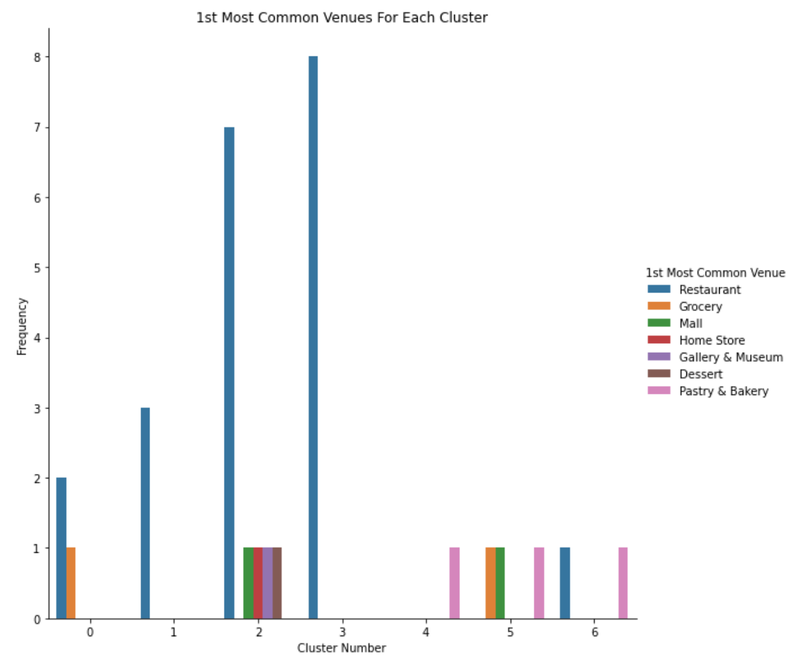

Based on the bar graph above, clusters are

Cluster 0: 'Restaurant and Grocery'

Cluster 1: 'Restaurant'

Cluster 2: 'Restaurant and many other venues'

Cluster 3: 'Restaurant'

Cluster 4: 'Pastry & Bakery'

Cluster 5: 'Pastry & Bakery, Mall and Grocery'

Cluster 6: 'Restaurant, Pastry & Bakery'

Since Cluster 2 have many different venues such as restaurants, malls, home store, gallery & museum and dessert, these are the areas where there are consumers visit the most. Therefore, Olist have to consider the boroughs in Cluster 2 for their offline store. 

Boroughs in Cluster 2 are 
```
# Examine cluster 2
saopaulo_merged.loc[saopaulo_merged['Cluster Labels'] == 2, 
                     saopaulo_merged.columns[[0] + list(range(4, saopaulo_merged.shape[1]))]]
```
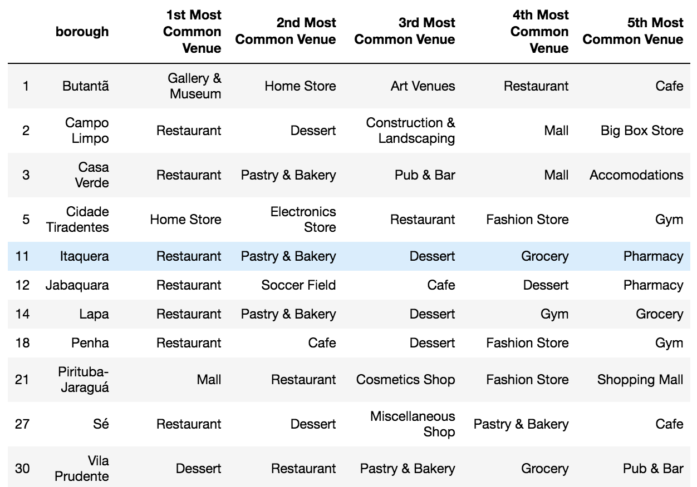

Sao Paulo is the city where Olist is getting their revenue the most. To open the offline store in Sao Paulo, they want to consider the area where consumers visit the most, where it's easily accessible by consumers. Cluster 2 is boroughs where there are many different social and art venues so they are the best boroughs to consider for opening the offline store. Therefore, Olist have to consider boroughs above.


### 3. Sales prediction on hour, month and season with the most revenues

- Convert the date and time into 'datetime' then add new columns of months and hours
```
# convert the time and date of order to 'datetime'
cust_order_pay_df['order_purchase_timestamp'] = pd.to_datetime(cust_order_pay_df['order_purchase_timestamp'])

# add new columns of month and hour
cust_order_pay_df['order_month'] = cust_order_pay_df['order_purchase_timestamp'].dt.month
cust_order_pay_df['order_hour'] = cust_order_pay_df['order_purchase_timestamp'].dt.hour
```
- Create a new dataframe consist of months and the amount of payment made each month
```
# Create a new dataframe consist of months and the amount of payment made
order_month_df = cust_order_pay_df.groupby('order_month').sum().reset_index()
order_month_df = order_month_df.loc[:, ['order_month','payment_value']]
```

- Plot the dataframe of months with bar graph
```
colors = list('rrggggggbbbb')

order_month_df.plot('order_month', 'payment_value', kind='bar', 
                    color=colors, legend=None)
plt.ticklabel_format(useOffset=False, style='plain', axis='y')
plt.xlabel('Month')
plt.ylabel('Total payment')
plt.xticks(rotation=360)
plt.title('Total payment made for each month')
```
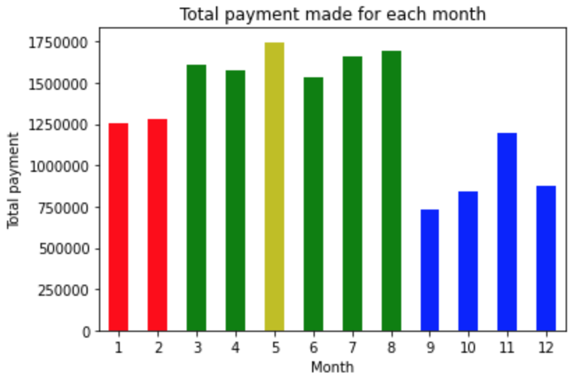
Based on the bar graph above, 
1. May is the month with the highest revenue but the revenue on July and Auguest are almost identical as May.
2. Revenue drops in the early fall and stays relatively low through the winter then start to increase in the late winter and stays relatively high through spring and summer. Therefore, from early spring to the late summer is the best seasons to generate revenues and from early autummn to the early winter is the worst season to generate revenue.


- Create a new dataframe consists of hours and the amount of payment made each hour
```
order_hour_df = cust_order_pay_df.groupby('order_hour').sum().reset_index()
order_hour_df = order_hour_df.loc[:, ['payment_value', 'order_hour']]
```

- Plot the dataframe of hours with bar graph
```
colors2 = list('rrrrrrrrrrggggygygggggbb')

order_hour_df.plot('order_hour', 'payment_value', kind='bar', 
                   color=colors2, legend=None)
plt.ticklabel_format(useOffset=False, style='plain', axis='y')
plt.xlabel('Hour')
plt.ylabel('Total Payment')
plt.xticks(rotation=360)
plt.title('Total payment made at each hour')
```
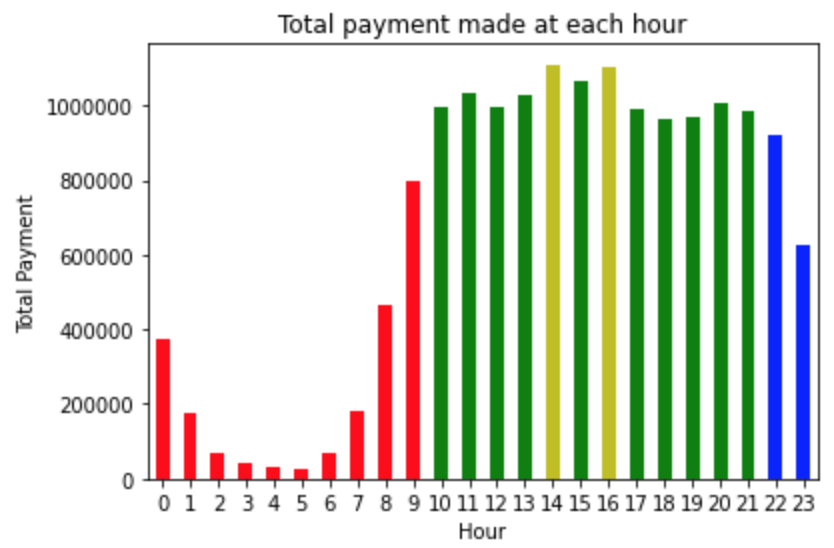
Based on the bar graph above,
1. Time that generates the highest revenue are at 14:00 and 16:00.
2. Since most of consumers are sleeping around 01:00 to 7:00, revenue is extremely low. Then revenue start increasing from the early morning and stays high from 10:00 to 21:00 then start decreasing.


### 4. Top product types that are generating the revenue the most
Products are categorized into 73 categories. I used 3 dataframes which are order_item_df, products_df and productname_df.
First, I merged products_df and productname_df to get the english name of each product.
```
merged1 = pd.merge(productname_df, products_df, on='product_category_name', how='inner')
```

Then I joined merged dataframe and order_item_df to match the payment that is made and products.
```
merged2 = pd.merge(merged1, order_item_df, on='product_id', how='inner')
```

Lastly, I grouped by the product name, sum them then sort the values in descending order and return the columns of name and total sum.
```
merged2_grouped = merged2.groupby('product_category_name_english').sum().reset_index()
merged2_grouped.sort_values(by='price', ascending=False, inplace=True)
merged2_grouped.rename(columns={'price':'Total Sum'}, inplace=True)
merged2_grouped.loc[:, ['product_category_name_english', 'Total Sum']].head(10)
```
Plot the result using horizontal bar chart.
```
for_plot=merged2_grouped.loc[:, ['product_category_name_english', 'Total Sum']].head(10)

sns.barplot(x='Total Sum', y='product_category_name_english', data=for_plot,
           palette='RdPu')

plt.ticklabel_format(useOffset=False, axis='x', style='plain')
plt.xlabel('Total')
plt.ylabel('Product Category')
plt.title('Total sum for each product category')
```
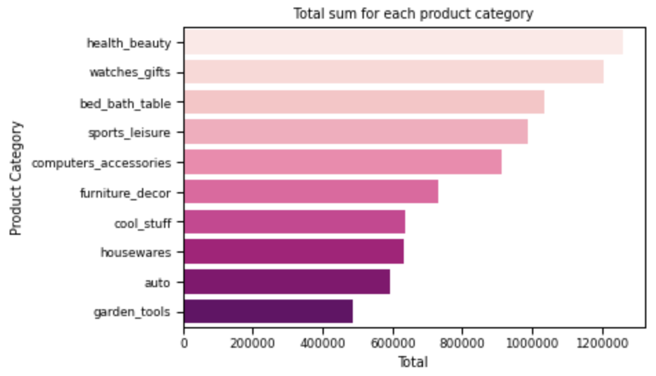


### 5. Customer satisfaction on products: Top and bottom 10 product categories
Merge the dataframe
```
merged_review = pd.merge(review_df, merged2, on='order_id', how='inner')
```
Group by "product category", get mean then sort the values in both ascending and descending orders to get the top and bottom 10 product categories
```
merged_review2 = merged_review.groupby('product_category_name_english').mean().reset_index()
for_plot2 = merged_review2.sort_values(by='review_score', ascending=False).head(10)
for_plot3 = merged_review2.sort_values(ascending=True, by='review_score').head(10)
```
Plot top 10 product categories
```
sns.barplot(y='product_category_name_english', x='review_score', data=for_plot2,
           palette='GnBu_d')
plt.xlabel('Review Score')
plt.ylabel('Product Categories')
plt.title('Top 10 Product Categories')
```
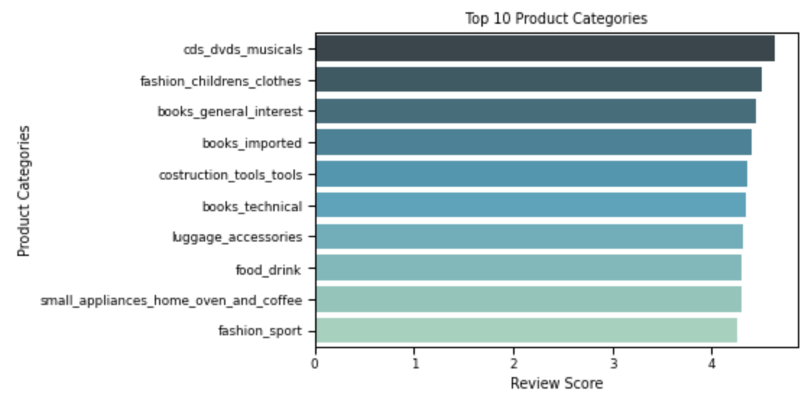

Plot bottom 10 product categories
```
sns.barplot(x='review_score', y='product_category_name_english', data=for_plot3,
              palette=('GnBu_d'))
# 'paper' makes things smaller and 'poster' make things larger
sns.set_context('paper')

plt.xlabel('Review Score')
plt.ylabel('Product Categories')
plt.title('Bottom 10 Product Categories')
```
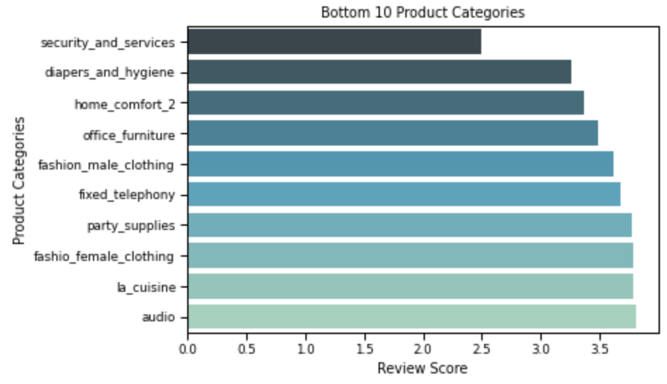


### 6. How much are consumers willing to pay for shipping cost?

Get necessary columns from the dataframe 'order_item_df' then get the total amount of payment for each order. Then get the ration of shipping cost to the total amount.
```
df_ratio = order_item_df.loc[:, ['price', 'freight_value']]
df_ratio['total'] = df_ratio['price'] + df_ratio['freight_value']
df_ratio['ship_ratio_to_sum'] = df_ratio['freight_value'] / df_ratio['total']

# round the ration to 2 decimals
df_ratio['ship_ratio_to_sum'] = round(df_ratio['ship_ratio_to_sum'], 2)
```
Get the list of values of ratios, create a new dataframe that only contains the shipping cost ratio to total payment column. After that, group the dataframe by 'shipping cost ratio' then count the number of orders placed then merge the dataframe with the new dataframe.
```
list_of_ratio = list(df_ratio['ship_ratio_to_sum'].unique())

df_ratio_count = pd.DataFrame(list_of_ratio).rename(columns={0:'ship_ratio_to_sum'})

df_ratio_groupby = df_ratio.groupby('ship_ratio_to_sum').count()
df_ratio_count = pd.merge(df_ratio_groupby, df_ratio_count, on='ship_ratio_to_sum', how='inner')
df_ratio_count.drop(['price', 'freight_value'], axis=1, inplace=True)
df_ratio_count.rename(columns={'total':'count'}, inplace=True)
```
Based on the sum of number of orders placed, it returns 112650. Therefore, divide each values in count column to get the count_ratio for the percentage each shipping cost ratios takes and sort the values in descending order.
```
df_ratio_count.sum()
df_ratio_count['count_ratio'] = df_ratio_count['count']/112650
df_ratio_count.sort_values(ascending=False, by='count_ratio')
```
Plot the dataframe with the bar plot
```
sns.barplot(x='ship_ratio_to_sum', y='count', palette='GnBu_d',
           data=df_ratio_count)
sns.set(rc={'figure.figsize':(20,20)})
plt.xticks(rotation=90, size=13)
plt.yticks(size=13)
plt.ylabel('Number of orders placed', size=13)
plt.xlabel('Shipping ratio to the total payment', size=13)
```

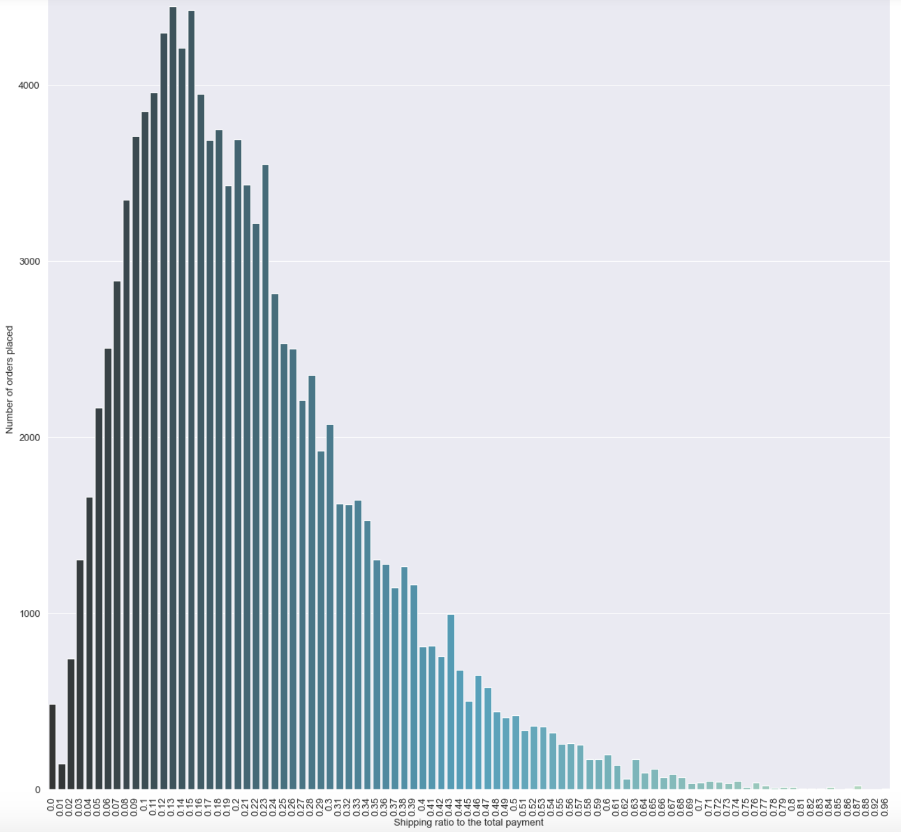
: Based on the result, 
It seems ideal ratio of shipping cost to the total paymeny of the order < 0.25 and
I believe the ratio should at least be < 0.35
I recommend
1. Shipping cost discount for bundle purchase 
2. Offering slower delivery with lower shipping cost for the product with relatively low price to keep the ratio low, ideally < 0.25.
3. shipping cost discount for the customers living in the region far from the seller.


### 7. Did the delivery affect the review score?
- Get the necessary dataframes merged then get create a new dataframe with necessary columns only and calculate and add the new column total_paid and shipping_ratio.
```
order_review_df = pd.merge(order_df, review_df, on='order_id', how='inner')
order_review_df2 = pd.merge(order_review_df, order_item_df, on='order_id', how='inner')
order_review_merged=order_review_df2.loc[:,['price', 'freight_value', 'review_score', 
                       'order_purchase_timestamp', 'order_delivered_customer_date']]
order_review_merged['total_paid'] = order_review_merged['price']+order_review_merged['freight_value']
order_review_merged['shipping_ratio'] = order_review_merged['freight_value']/order_review_merged['total_paid']
```

- 1. Does the shipping cost ratio affect the review score?

From the new dataframe, group by 'review_score' and get the mean of 'shipping_ratio'. Then, plot it with the bar graph.
```
review_ship_mean = order_review_merged.groupby('review_score').mean().reset_index()
```
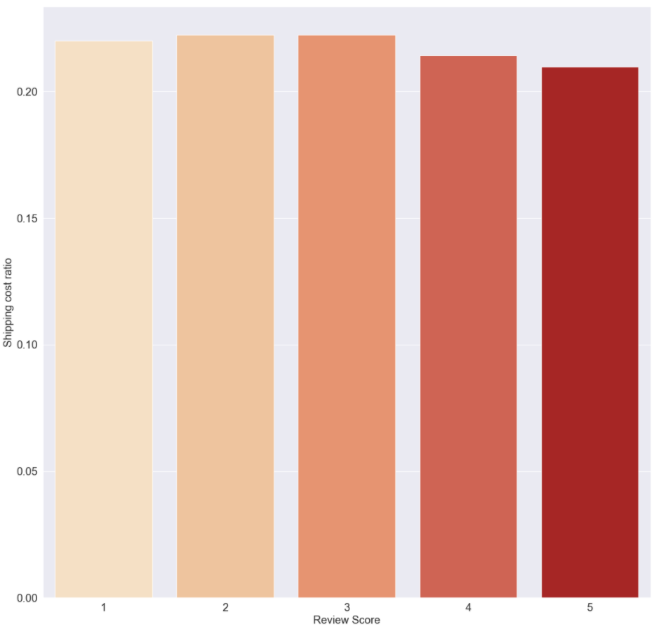
--> Bar plot shows that there is no clear difference between the effect of ratio of shipping cost on review scores. Therefore, review scores were not affected by the ratio of shipping costs.

- 2. Do customers tend to less satisfied when the delivery takes longer time?
```
# make a new dataframe with only necessary columns
order_time = order_review_df.loc[:, ['order_purchase_timestamp', 
                                     'order_delivered_customer_date', 'review_score']]
                                     
# convert to datetime types
order_time['order_purchase_timestamp'] = pd.to_datetime(order_time['order_purchase_timestamp'], errors='coerce')
order_time['order_delivered_customer_date'] = pd.to_datetime(order_time['order_delivered_customer_date'], errors='coerce')

# create new columns only with dates
order_time['date_order'] = order_time['order_purchase_timestamp'].dt.date
order_time['date_delivered'] = order_time['order_delivered_customer_date'].dt.date

# Remove rows with NaT values
order_time = order_time.dropna(axis=0, how='any')

# Get days between order date and delivery date
order_time['days_between'] = (
    pd.to_datetime(order_time['date_delivered']) -
    pd.to_datetime(order_time['date_order'])
).apply(lambda x: x.days)

order_time = order_time.reset_index()
```

Then group by 'review_score' and get the mean value of 'days_between".
```
order_time2 = order_time.loc[:, ['review_score', 'days_between']].groupby('review_score').mean()
order_time2.reset_index(inplace=True)
```

Plot the result
```
sns.barplot(x='review_score', y='days_between', data=order_time2,
           palette = "GnBu")
plt.xticks(size=30)
plt.yticks(size=30)
plt.xlabel('Review Score', size=30)
plt.ylabel('Average Delivery Time', size=30)
plt.annotate('.',
            xy=(0, 22.3), 
            arrowprops=dict(facecolor='black', shrink=0.1, width=10, headwidth=50),
            xytext=(4.5,10)
            )
plt.text(1.1, 20, 'Review score decreases as Delivery time increases',
        size=31)
```

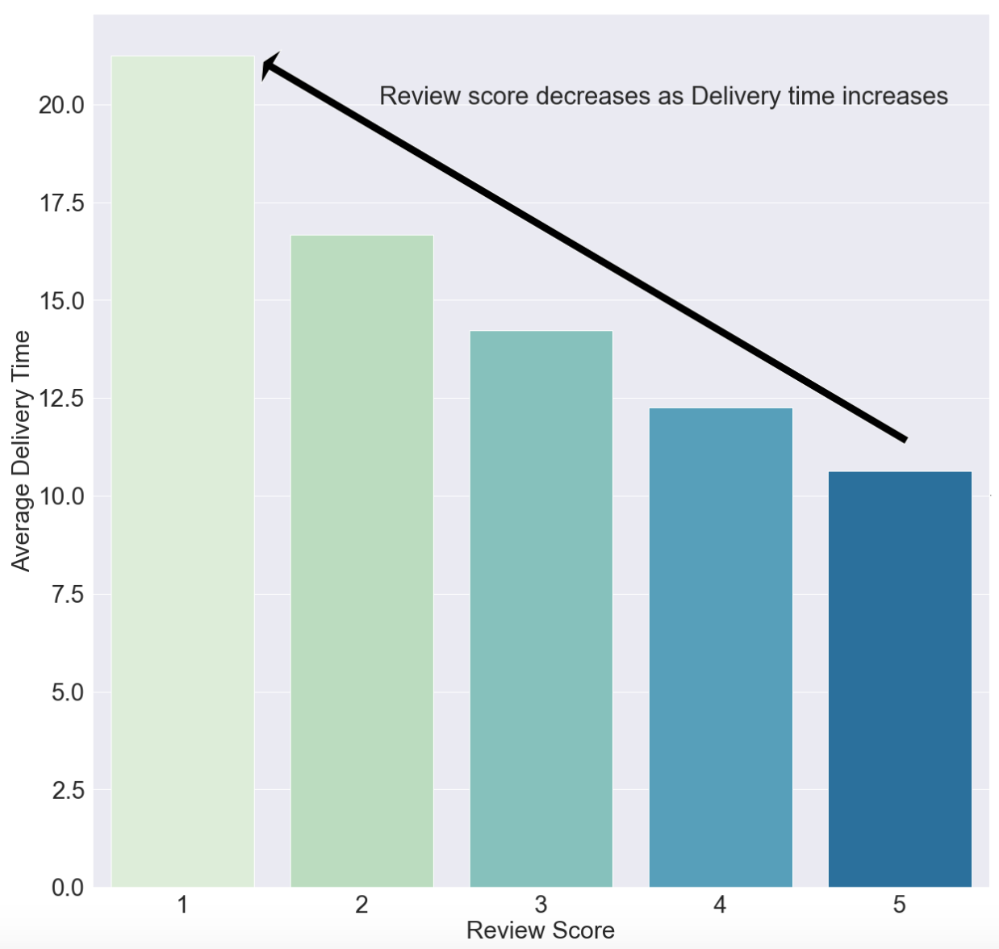


```
# Other possible questions to analyze


Delivery Performance (Consumption of time till the arrival of the parcels)

Who pays more for the delivery fee? (Depends on city and purchase cost)

```
